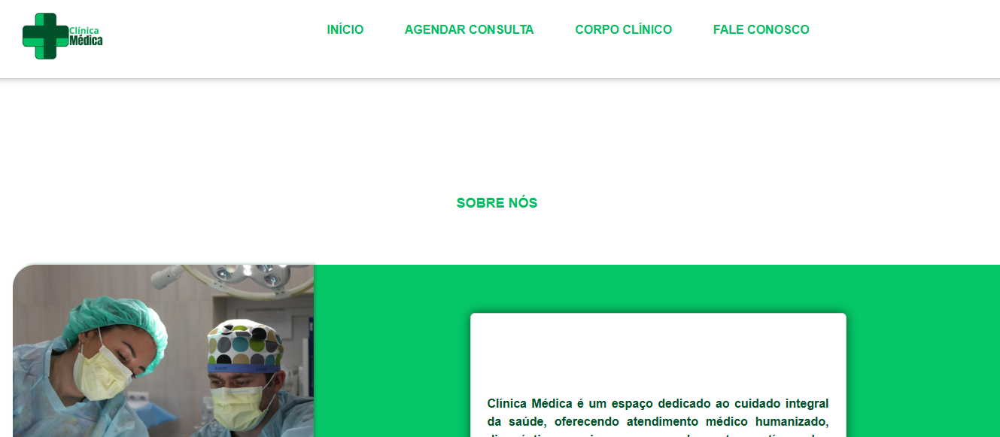
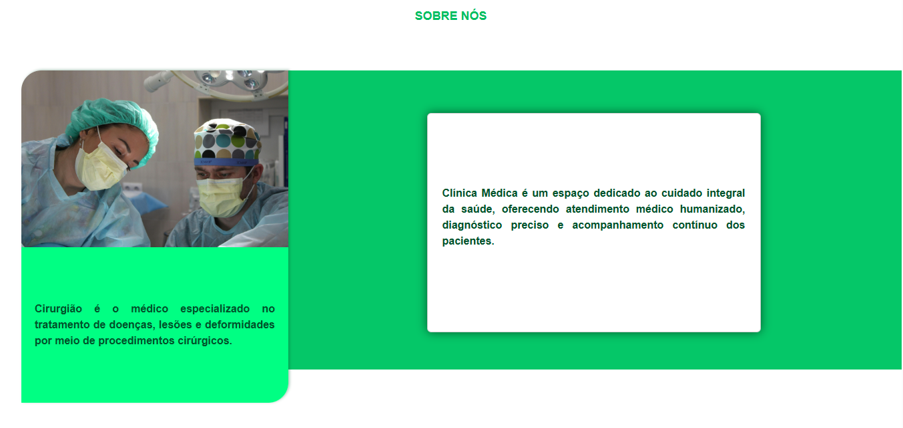
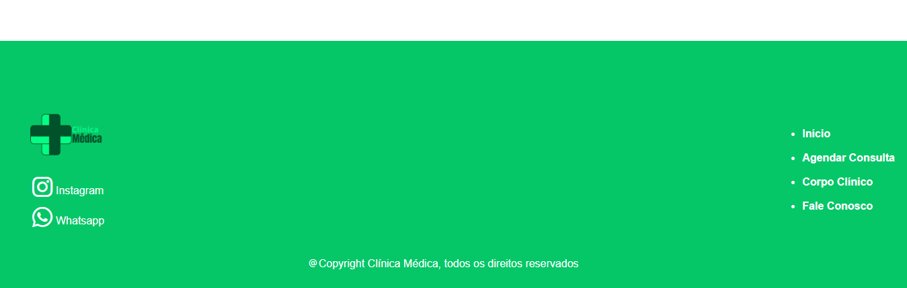
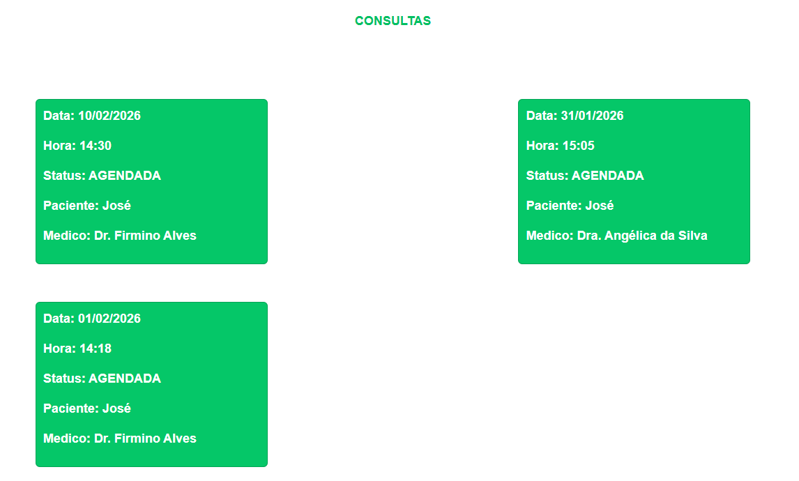
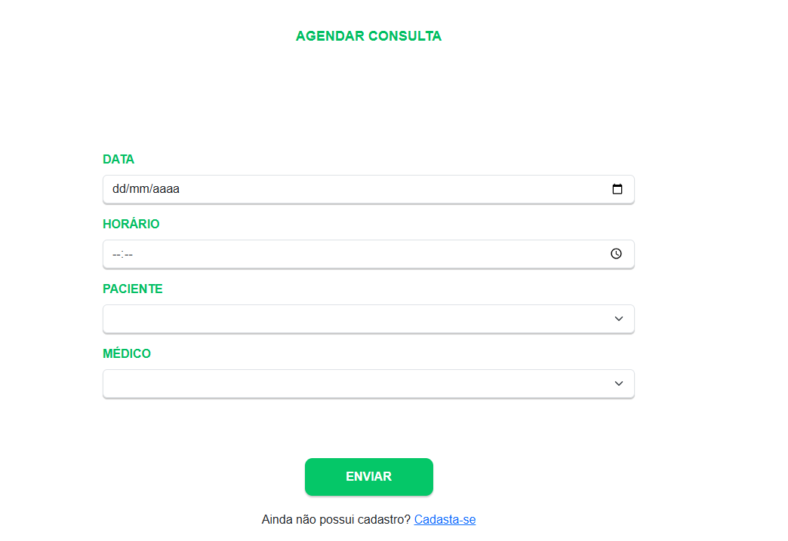
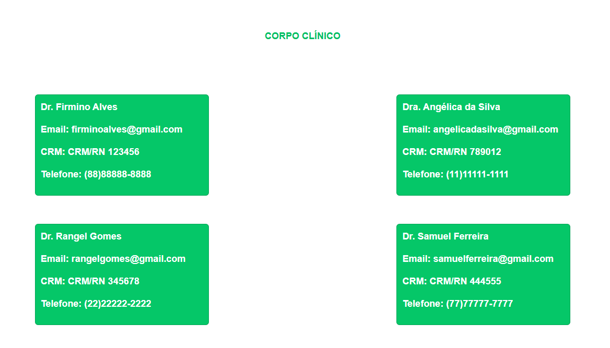

# Clínica Médica Frontend

## Description 

This application facilitates communication between users (patients) and the database through the Clínica Médica interface. 

The system provides access to two features that can be accessed through the menu: Doctor Registration (cadastro_medico), where new medical professionals can be registered, and Appointments (consulta), which allows for managing and viewing patient schedules. Overall, this interface serves as a comprehensive management system for a medical clinic. 

This web system was built using the following technologies: HTML5, CSS3, JavaScript, Bootstrap, Sass, Figma. 

This project was developed to link patients and doctors through a scheduling system.

## Installation Instructions

You don't need to install anything to run this project.

## Usage

To use this interface, download the project to your computer and run it locally.
After download this project, you can open any page. 

